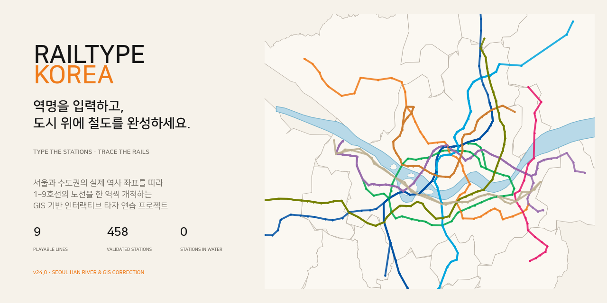
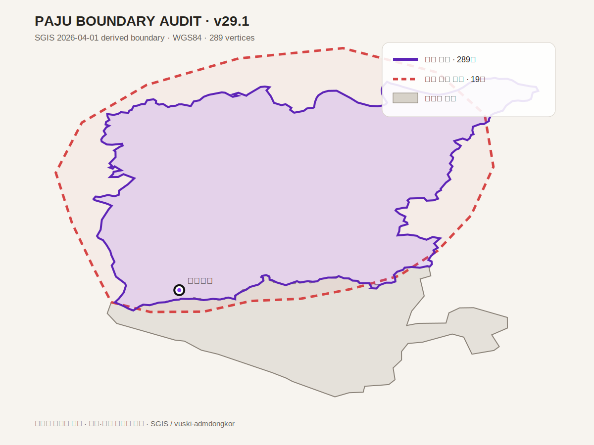
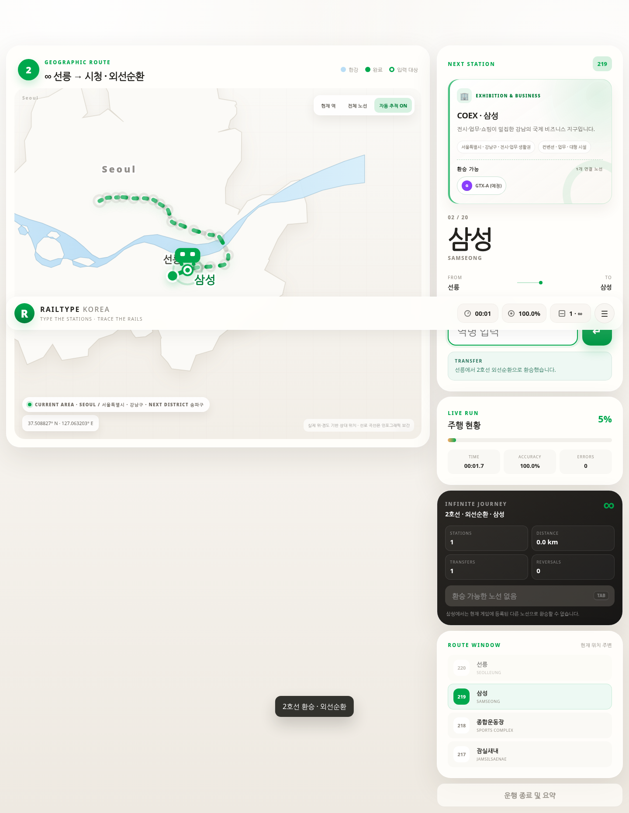
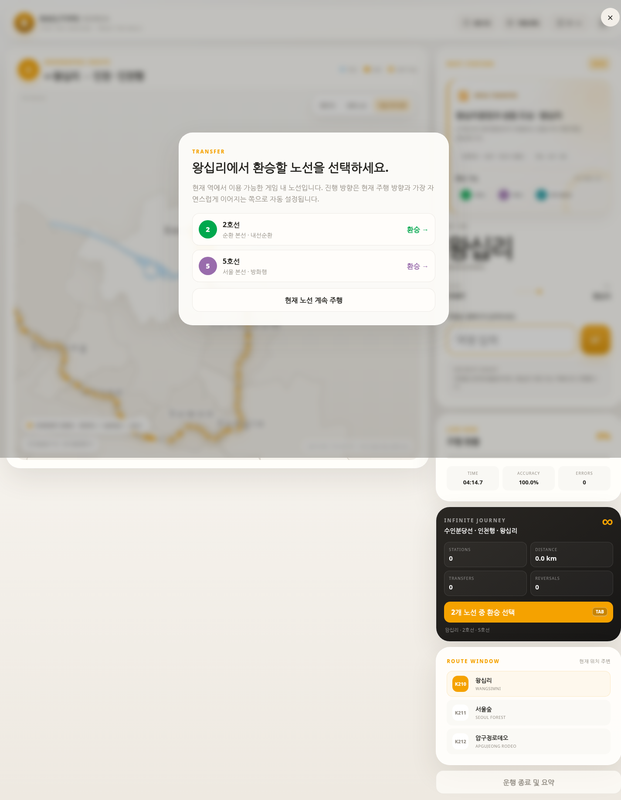
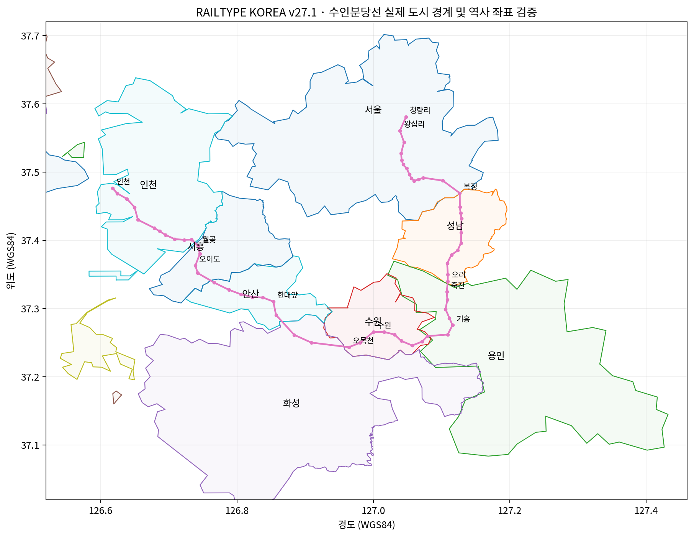
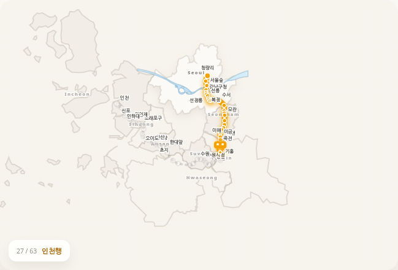
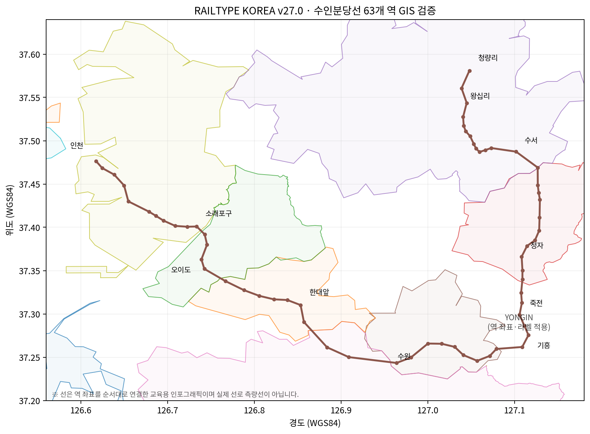
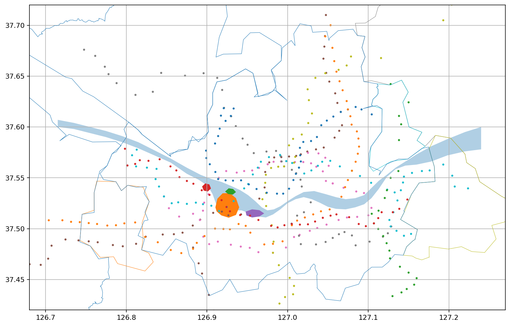
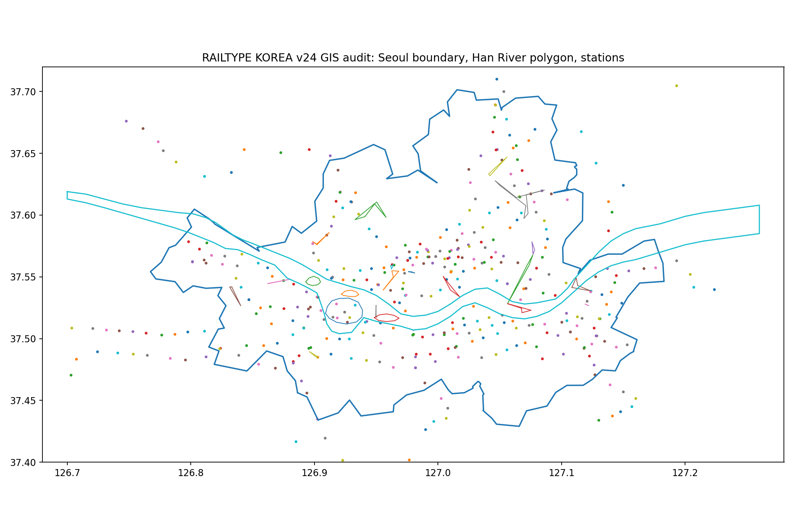
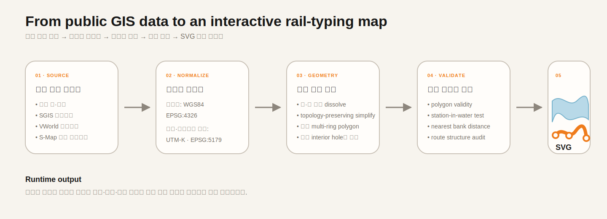

<div align="center">



# RAILTYPE KOREA

### Type the Stations · Trace the Rails

역명을 정확히 입력하며 실제 지리 좌표 위에 철도를 한 역씩 완성하는 **GIS 기반 인터랙티브 타자 연습 웹앱**입니다.

`Vanilla JavaScript` · `SVG` · `GeoJSON` · `WGS84` · `GitHub Pages`

</div>

> **GitHub Pages URL**  
> https://gshark1348.github.io/railtype_korea/

---

## 프로젝트를 만든 이유

우리는 종종 멀리 떨어진 곳에서 새로운 가치와 이야기를 찾습니다. 여행지의 골목과 명소는 열심히 찾아보면서도, 정작 매일 타고 다니는 지하철이 어떤 동네를 지나고 각 역이 서울의 어디에 놓여 있는지는 잘 모르는 경우가 많습니다.

**RAILTYPE KOREA**는 이 익숙하지만 낯선 도시를 다시 바라보기 위한 프로젝트입니다. 과거 학교 컴퓨터실에서 사용하던 타자 연습 프로그램의 단순하고 즉각적인 성취감에서 영감을 받아, 역명을 입력할 때마다 실제 지도 위에 선로가 놓이고 도시의 한 구간이 완성되는 게임으로 재해석했습니다.

사용자는 단순히 역 이름을 외우는 데서 끝나지 않습니다. 각 역이 놓인 지리적 위치, 주변 동네의 특징과 대표 장소, 노선이 계획되고 개통·연장된 과정까지 함께 살펴보며 **철도를 통해 도시의 역사와 지리를 학습**하게 됩니다.

---

## v30.3 · 사운드 재생 보강 및 KTX·SRT 서비스 통합

브라우저에서 들리지 않던 인터페이스 사운드를 실제 WAV 음원 우선 재생 방식으로 보강하고, 고속철도 선택·환승 구조를 운영 브랜드 중심으로 정리했습니다.

- 짧게 제작한 `key-soft.wav`, `click-soft.wav`를 미리 불러와 타이핑·클릭 시 즉시 재생합니다.
- WAV 재생이 차단되거나 지원되지 않으면 Web Audio 합성음으로 자동 대체합니다.
- 기존보다 체감 가능한 음량으로 조정하고 상단에 `SOUND ON/OFF` 상태를 명확하게 표시합니다.
- KTX 경부·호남·강릉·KTX-이음·전라·경전·동해 계통을 **KTX 대표 항목 하나**로 통합했습니다.
- SRT 경부·호남·전라·경전·동해 계통을 **SRT 대표 항목 하나**로 통합했습니다.
- KTX 10개 코스와 SRT 5개 코스는 각 대표 항목을 누른 뒤 노선 설정 화면 내부에서 선택합니다.
- 역별 환승 칩과 무한모드 환승 목록에는 세부 계통을 반복하지 않고 `KTX`, `SRT`로 한 번씩만 표시합니다.

---

## v30.2 · 조용한 타건음과 인터페이스 클릭음

타이핑과 버튼 조작에 은은한 소리 피드백을 더했습니다.

- 텍스트 입력 시 짧고 부드러운 타건음을 재생합니다.
- 버튼·링크·선택 UI 조작에는 타건음보다 낮은 클릭음을 재생합니다.
- 별도 음원 파일 없이 Web Audio API로 즉시 합성하므로 추가 다운로드가 없습니다.
- 상단 스피커 버튼에서 언제든 음소거할 수 있으며 선택은 브라우저에 저장됩니다.
- 브라우저의 자동 재생 정책에 맞춰 첫 사용자 조작 이후에만 오디오가 활성화됩니다.
- 한글 IME 조합, 보조키, 빠른 키 반복에서는 불필요한 소리 중첩을 억제합니다.

---

## v30.1 · 실제 열차 사진 전환

노선 설정 화면의 프로젝트 콘셉트 열차 그래픽을 실제 해당 차량 사진 또는 명확한 개통 예정 상태로 교체했습니다.

- **GTX-A**: A702 실제 차량 사진으로 교체
- **KTX-이음**: 중앙선·중부내륙선·동해선 등 모든 KTX-이음 카드에 실제 차량 사진 적용
- **SRT**: 경부·호남·전라·경전·동해선 카드에 실제 SRT 130000호대 사진 적용
- **GTX-B·GTX-C**: 아직 영업 운행 차량이 없으므로 임의 콘셉트 이미지를 제거하고 `개통 예정 · 영업 운행 차량 사진 없음`으로 표시
- 실제 사진의 저작자·라이선스·원본 페이지를 설정 화면과 `THIRD_PARTY_NOTICES.md`에 기록

---

## v30.0 · 전국 KTX·KTX-이음·SRT 확장

v29.2의 KTX 경부·호남고속선 복원본을 기반으로 현재 운행 중인 나머지 KTX 계통과 SRT 전 노선을 플레이 가능한 코스로 연결했습니다.

- **KTX·KTX-이음 7개 계통 추가**: 강릉선(서울–강릉 / 서울–동해), 중앙선, 중부내륙선, 전라선, 경전선, 동해선(서울–포항), 동해선 KTX-이음(강릉–부전)
- **SRT 5개 계통 추가**: 경부선, 호남선, 전라선, 경전선, 동해선
- 기존 KTX 경부·호남을 포함해 고속철도 카테고리에서 **14개 운행계통**을 모두 선택할 수 있습니다.
- 신규 12개 노선은 양방향 주행, 전국 경계 지도, 역별 설명, 역사 타임라인, 독립 완주 기록을 제공합니다.
- 같은 역명을 공유하는 KTX·SRT·도시철도·GTX 노선은 무한모드 환승망에서 자동 연결됩니다.
- KTX-이음과 SRT는 v30.1부터 실제 해당 열차 사진을 사용합니다.

정차역 목록은 노선 학습을 위한 대표 코스입니다. 실제 열차는 편성·시간대에 따라 일부 역을 통과하므로 여행 전 코레일·SRT 시간표를 확인해야 합니다. 기준일은 **2026-07-16**입니다.

---

## v29.2 · KTX 경부·호남고속선 복원

v29.1의 GTX-A·B·C와 파주시 경계 보정을 그대로 유지하면서, v26.1 이후 비활성화되었던 KTX 두 노선을 최신 공통 주행 엔진에 다시 연결했습니다.

- **KTX 경부고속선**: 서울–광명–천안아산–오송–대전–김천구미–서대구–동대구–경주–울산–부산, 11개 대표 정차역
- **KTX 호남고속선**: 용산–광명–천안아산–오송–공주–익산–정읍–광주송정–나주–목포, 10개 대표 정차역
- 두 노선 모두 정방향·역방향 주행, 모션 데모, 역사 타임라인, 열차 이미지와 독립 완주 기록을 제공합니다.
- 대한민국 전국 경계 레이어와 KTX 역 좌표·검증 자료를 복원했습니다.
- KTX를 노선 선택 화면과 무한모드 출발·환승 목록에 등록했습니다.
- v29.1의 GTX 3개 노선, 수인분당선, 1–9호선과 파주시 289점 경계는 변경하지 않았습니다.

---

## v29.1 · 파주시 행정경계 보정

GTX-A 운정중앙 구간에 표시되는 파주시 외곽을 실제 행정경계 자료를 참고해 다시 구성했습니다.

- 19개 임의 점으로 만든 단순 외곽선을 **SGIS 계열 2026-04-01 시군구 경계의 289개 정점**으로 교체했습니다.
- 좌표는 WGS84(EPSG:4326), 소수점 6자리로 정규화했습니다.
- 파주–고양 접경의 최근접 오차는 약 4.34m이며, 운정중앙역이 파주시 폴리곤 안에 포함되는 것을 확인했습니다.
- 기존 단순 외곽의 근사 면적은 약 934.2㎢였으나, 보정 후 약 682.4㎢로 축소되어 파주시 공개 면적 674.4㎢에 가까워졌습니다.
- 원본 GeoJSON과 검증 결과는 `data/paju-boundary-v29.1.geojson`, `data/paju-boundary-validation-v29.1.json`에 보관합니다.

경계 원자료는 [국가데이터처 SGIS 행정구역 통계 및 경계](https://www.data.go.kr/data/15129688/fileData.do)이며, WGS84 웹용 가공본은 [vuski/admdongkor](https://github.com/vuski/admdongkor)를 사용했습니다. 이 지도는 학습용 단순화 경계이며 법적·지적 판정에는 사용할 수 없습니다.



---

## v29.0 · 수도권광역급행철도 GTX-A·B·C

GTX 세 노선을 공통 주행·지도·환승 엔진에 정식 등록했습니다.

- **GTX-A**: 운정중앙–동탄 11개 역. 2026년 7월 기준 개통역과 창릉·삼성 계획역을 역 상태 데이터로 구분합니다.
- **GTX-B**: 인천대입구–마석 14개 계획역을 잇는 사전 학습 코스입니다.
- **GTX-C**: 덕정–수원 13개 역 본선과 금정–상록수 분기를 각각 선택할 수 있습니다.
- 서울역(A↔B), 삼성(A↔C), 청량리(B↔C) 등 같은 역 이름을 공유하는 지점은 무한모드 환승망에 자동 연결됩니다.
- 각 노선의 양방향 주행, WGS84 지도, 행정구역 표시와 노선 역사를 제공합니다. GTX-A는 실제 차량 사진, B·C는 개통 예정 상태 카드를 표시합니다.
- B·C와 A의 미개통 역은 실제 개통 노선처럼 보이지 않도록 설정 화면과 역 설명에서 **계획 노선**으로 표시합니다.

사업 일정과 역 계획은 바뀔 수 있습니다. 노선 기준일은 **2026-07-16**이며, 공식 현황은 [GTX-A 공식 홈페이지](https://www.gtx-a.com/)와 [경기도 GTX 추진 현황](https://www.gg.go.kr/contents/contents.do?ciIdx=497&menuId=1850)을 참고했습니다.

---

## v28.2 · 무한 운행 경로 지도·모션 데모·게임 화면 개선

무한모드 종료 결과와 노선 설정 화면, 실제 게임 레이아웃을 함께 개선했습니다.

- 무한모드에서 이동한 역의 WGS84 좌표를 노선 구간별로 저장합니다.
- 종료 결과의 지도에는 마지막 노선만 표시하지 않고, 출발부터 운행 종료까지 이동한 전체 경로를 노선색별로 표시합니다.
- 출발점·환승 지점·최종 운행 종료역을 지도에서 구분해 표시합니다.
- 무한 여정 지도와 오타·거리·노선별 구간 분석은 비공개 결과 화면에서만 제공됩니다.
- 노선 설정 모달이 숨겨진 상태에서 SVG 경로 길이가 0으로 계산되어 모션 데모가 정지하던 문제를 수정했습니다.
- 설정 모달이 실제로 열린 뒤 데모 지도를 다시 생성하고 자동 재생합니다.
- 데스크톱 게임 화면을 한 뷰포트 안에 맞추도록 지도·입력·진행률·환승·주변 역 패널을 압축형 반응형 레이아웃으로 재구성했습니다.
- 태블릿과 모바일에서는 기존처럼 세로형 레이아웃으로 전환합니다.

---

## v28.1 · 입력 대상역·열차·환승 위치 동기화

타자 UI에 표시되는 역과 지도 위 열차·선로·환승 판정이 서로 다른 역을 참조하던 문제를 수정했습니다. 이제 화면의 **현재 입력 대상역**을 단일 기준점으로 사용합니다.

- 현재 입력 대상역과 열차 좌표, 현재 노드가 항상 같은 역을 가리킵니다.
- 정답 입력 직후 UI를 다음 행선지로 전환하고, 열차와 진행 선로가 해당 역까지 이동합니다.
- 무한모드 환승 가능 여부와 `TAB` 환승은 직전 역이 아닌 현재 입력 대상역에서 계산합니다.
- 환승·종착역 회차 직후에도 입력 대상역과 열차 위치를 즉시 동기화합니다.
- 열차가 역 사이를 이동하는 동안에는 환승 버튼을 잠가 중간 구간 환승을 방지합니다.
- 일반모드와 무한모드 모두에서 현재 노드 인덱스와 열차 진행 위치가 일치하는지 브라우저 회귀 테스트를 추가했습니다.



---

## v28.0 · 무한모드 추가

노선 하나를 완주하는 기존 기록 경쟁과 별도로, 게임에 등록된 철도망을 환승하며 계속 주행할 수 있는 **무한모드**를 추가했습니다. 현재 프로젝트에 등록된 1–9호선과 수인분당선이 출발·환승 대상에 자동으로 포함되며, 이후 `window.METRO_LINES`에 새 노선을 등록하면 무한모드에도 함께 반영됩니다.

- 출발 노선·코스·역·진행 방향을 사용자가 직접 선택합니다.
- 현재 역에서 환승 가능한 게임 내 노선만 환승 버튼에 표시합니다.
- 환승 가능한 노선이 1개이면 `TAB`으로 즉시 환승합니다.
- 환승 가능한 노선이 2개 이상이면 선택 모달을 표시합니다.
- 환승하면 노선색, 노선 번호, 열차와 지도 UI가 새 노선 테마로 전환됩니다.
- 종착역에 도착하면 진행 방향을 자동으로 반전해 반대편으로 계속 운행합니다.
- 운행 종료 시 입력 역 수, 이동 거리, 이용 노선, 환승·회차 횟수, 여정 구간과 오답 유형을 요약합니다.
- 무한모드 기록은 커뮤니티에 공개하지 않으며 일반모드 완주 기록에도 저장하지 않습니다.



---

## v27.1 · 수인분당선 도시 경계·역 위치 보정

- 서울·성남·용인·수원·화성·안산·시흥·인천의 실제 행정경계 폴리곤을 수인분당선 지도에 표시합니다.
- 잘못된 도시 경계 렌더링 데이터 형식을 수정했습니다.
- 누락됐던 용인시는 수지구·기흥구·처인구 경계를 하나의 시 경계로 통합했습니다.
- 63개 역은 WGS84 공공 철도 기준점을 그대로 사용하며 화면용 임의 오프셋을 적용하지 않습니다.
- 모든 역이 지정된 도시 폴리곤 안에 위치하는지 EPSG:5179 거리 검증을 수행했습니다.





## v27.0 · 수인분당선 추가

수인분당선을 내부 노선 번호 `12`로 등록해 기존 1–9호선과 독립적으로 플레이하고 기록을 비교할 수 있습니다.

- `청량리–인천 전 구간`: 63개 역
- `왕십리–인천 주 운행축`: 62개 역
- 방향 선택: 인천행 / 청량리행 / 왕십리행
- 노선색: `#F5A200`
- START 전 전체 노선 모션 데모
- 역별 랜드마크·생활권 텍스트
- 수인분당선 전용 커뮤니티 최고 기록
- WGS84 역사 좌표와 수도권 GIS 배경 적용




> 실제 일부 열차만 청량리까지 연장 운행하므로, 주 운행계통에 가까운 왕십리–인천 코스를 별도로 제공합니다.

---

## 현재 제공되는 경험

- **무한모드**  
  출발 노선·역·방향을 선택한 뒤 환승과 자동 회차를 반복하며 등록된 철도망을 계속 주행합니다.
- **환승 버튼과 TAB 단축키**  
  한 개의 환승 노선은 즉시 전환하고, 여러 노선이 연결된 역에서는 선택창을 제공합니다.
- **비공개 무한 여정 지도와 분석**  
  무한모드 종료 시 실제 이동 경로를 노선색별 지도에 표시하고 거리·입력 역·이용 노선·환승·회차·오답 분석을 제공하되 공개 순위에는 전송하지 않습니다.
- **수도권 전철·GTX와 전국 고속철도 플레이**  
  1–9호선·수인분당선·GTX-A·B·C 및 KTX·SRT를 선택할 수 있으며, 고속철도 세부 운행계통은 대표 서비스 내부에서 고릅니다.
- **종착역 방향 선택**  
  예를 들어 3호선의 오금행·수서행·구파발행·대화행처럼 실제 운행 방향을 선택합니다.
- **START 전 모션 데모**  
  선택한 노선이 지도 위에 완성되는 흐름을 미리 확인한 뒤 주행을 시작합니다.
- **정확한 한글 입력 판정**  
  현재 역명을 정확히 입력하고 Enter를 눌러야 다음 역으로 이동합니다.
- **역 단위 모션 그래픽**  
  정답을 입력할 때마다 선로, 역 노드, 열차 위치가 같은 지리 좌표를 기준으로 다음 역까지 이동합니다.
- **역 주변 이야기**  
  사진 중심 구성을 제거하고, 각 역의 대표 랜드마크·생활권·동네 특징을 짧은 텍스트로 제공합니다.
- **노선 역사 타임라인**  
  기획, 착공, 최초 개통, 연장 과정을 노선별 자료와 함께 확인할 수 있습니다.
- **실시간 주행 기록**  
  소요 시간, 정확도, 오답 수, 진행률을 플레이 중 실시간으로 표시합니다.
- **오답 유형 분석**  
  초성·중성·종성·복합 철자·글자 누락·글자 추가·띄어쓰기·한/영 전환 오류를 분류합니다.
- **개인 진척도 저장**  
  주행 기록과 완료한 코스를 브라우저 `localStorage`에 저장합니다.

---

## 화면과 지도 시각화

### GIS 개발 플롯

아래 이미지는 서울과 인접 도시의 경계, 한강 수계, 노선별 역 좌표를 한 화면에서 비교하며 초기 오차를 찾기 위해 사용한 개발 플롯입니다.



### v24 공간 검증 결과

한강을 단순한 두 개의 선이 아닌 실제 폭을 가진 폴리곤으로 구성하고, 서울 경계와 역 좌표를 중첩하여 수면 위에 잘못 놓인 역이 있는지 검사했습니다.



---

## 개발 과정

| 단계 | 개발 내용 |
|---|---|
| **Concept** | 학교 컴퓨터실의 타자 연습 경험과 서울 지하철 지리 학습을 결합한 게임 콘셉트 설계 |
| **UI Prototype** | 빈 서울 인포그래픽 위에 노선 선택 버튼을 배치하고, 완료한 노선만 점차 표시되는 메인 화면 구성 |
| **Typing Interaction** | 역명을 정확히 입력해야 다음 역으로 이동하며, 노드와 선로가 한 구간씩 생성되는 주행 로직 구현 |
| **Geographic Motion** | 열차와 선로가 역 노드보다 뒤처지지 않도록 전체 경로 비율이 아닌 **역 구간 단위 진행도**로 애니메이션 방식을 수정 |
| **Content Redesign** | 역별 배경 사진 방식에서 주변 랜드마크·생활권·동네 특징을 설명하는 텍스트 방식으로 전환 |
| **Line Expansion** | 1호선의 광역 지선, 2호선 순환·지선, 3–9호선의 본선·분기·급행 코스를 순차적으로 추가 |
| **Route Setup** | 전동차 이미지, 방향 선택, 노선 모션 데모, 노선 역사 타임라인을 START 전 설정 화면에 통합 |
| **v21** | 5호선과 기존 역 좌표의 행정경계·수면 교차 검증 및 위치 보정 자료 구축 |
| **v22** | 별내선이 연결된 8호선 추가, 서울–구리–남양주–성남 경계 검증 |
| **v23** | 9호선 일반·급행 코스 추가, 서울 서부–강남–강동 구간 좌표 검증 |
| **v24** | 강서·강동 한강 흐름 재구성, 섬 홀 처리, 1–9호선 전체 수면 교차 검사, GitHub Pages 배포 구조 정리 |
| **v27** | 수인분당선 63개 역과 실제 8개 도시 경계 폴리곤, 전용 리더보드 추가 |
| **v28.0** | 출발 위치·방향 선택, 환승, TAB 단축키, 종착역 자동 회차와 비공개 여정 분석을 갖춘 무한모드 추가 |
| **v28.1** | 입력 대상역·열차·진행 선로·환승 기준을 하나의 현재역 인덱스로 동기화 |
| **v28.2** | 무한 운행 전체 경로 지도, 노선 설정 모션 데모 복구, 한 화면 게임 레이아웃 적용 |
| **v29.0** | GTX-A·B·C 노선, 계획/개통 상태, C노선 분기, 광역 지도와 무한모드 환승 통합 |
| **v29.1** | 파주시 경계를 SGIS 계열 289점 WGS84 외곽선으로 교체하고 접경·면적·역 포함 검증 추가 |
| **v29.2** | KTX 경부·호남고속선, 전국 경계, 양방향 주행과 무한모드 연결 복원 |
| **v30.0** | 나머지 KTX·KTX-이음 7개 계통과 SRT 5개 계통, 전국 지도·환승·양방향 주행 통합 |
| **v30.1** | GTX-A·KTX-이음·SRT 실제 차량 사진 적용, GTX-B·C 개통 예정 플레이스홀더 전환 |
| **v30.2** | 타건음·클릭음 Web Audio 합성, 상단 음소거 제어와 사용자 설정 저장 추가 |
| **v30.3** | WAV 우선·Web Audio 대체 사운드 보강, KTX 10개·SRT 5개 코스를 두 대표 서비스 내부로 통합 |

---

## GIS 지도는 어떻게 만들었는가



### 1. 역사 좌표 수집과 통합

각 역은 WGS84 위도·경도 좌표를 기준으로 관리합니다. 서울교통공사 및 국가철도공단의 공개 역사 정보와 노선별 위치 데이터를 교차 확인하고, 런타임에서는 다음과 같은 공통 구조로 정규화합니다.

```js
{
  code: "309",
  name: "대화",
  en: "DAEHWA",
  lat: 37.676087,
  lng: 126.747569
}
```

- 런타임 좌표계: **WGS84 / EPSG:4326**
- 거리·수면 교차 검증 좌표계: **UTM-K / EPSG:5179**

### 2. 서울과 인접 도시 경계 생성

행정경계는 SGIS/KOSTAT 계열 시·군 경계 데이터를 기반으로 웹 렌더링에 필요한 지역만 추출했습니다.

1. 시·군 단위 피처 선택
2. 동일 지자체 조각을 하나의 `MultiPolygon`으로 통합
3. 경계의 연결 관계를 훼손하지 않는 topology-preserving simplification 적용
4. WGS84로 변환
5. GeoJSON과 브라우저용 JavaScript 데이터로 각각 저장

프로젝트는 서울만 잘라내지 않고 고양·김포·인천·부천·광명·과천·성남·하남·구리·남양주·의정부 등 노선이 실제로 통과하는 인접 지역을 함께 표시합니다.

### 3. 한강 폴리곤 생성

초기 버전의 한강은 북안과 남안의 소수 좌표를 연결한 단순 리본이었습니다. 이 방식은 강서구와 강동구에서 실제 흐름과 강폭을 충분히 표현하지 못했고, 행정경계 및 역 좌표와 중첩할 때 왜곡이 크게 보였습니다.

v24에서는 한강을 독립된 **multi-ring 수면 폴리곤**으로 재구성했습니다.

- **강서 구간:** 행주–방화–가양–염창 진입 방향과 강폭 보정
- **도심 구간:** 여의도·밤섬·선유도·노들섬을 수면 내부의 `hole`로 처리
- **강동 구간:** 암사–고덕–구리–하남 방향으로 이어지는 북동 굴곡과 수로 폭 보정
- 런타임 형상: `js/han-river-geometry.js`
- GIS 교환 형상: `data/han-river-geometry-v24.geojson`

SVG에서는 `fill-rule="evenodd"` 방식으로 외곽 수면과 섬 홀을 하나의 수면 레이어로 렌더링합니다.

### 4. 위·경도를 SVG 화면 좌표로 투영

현재 웹앱은 외부 지도 타일 없이 동작합니다. 선택한 노선의 지리 범위를 계산한 뒤 위·경도를 `1200 × 760` SVG 좌표로 선형 변환합니다.

```js
x = paddingX + ((lng - minLng) / (maxLng - minLng)) * usableWidth
y = paddingY + ((maxLat - lat) / (maxLat - minLat)) * usableHeight
```

같은 `project(lng, lat)` 함수를 행정경계, 한강, 역 노드, 노선 경로, 열차에 공통 적용하기 때문에 모든 지도 요소가 같은 좌표 기준으로 움직입니다.

### 5. 역 사이의 선로 플로팅

노선은 역의 실제 좌표를 순서대로 연결하되, 직선의 각진 느낌을 줄이기 위해 저긴장도 곡선으로 보간합니다. 초기 장력 `0.72`는 역 사이에서 경로가 실제 위치보다 과도하게 휘어지는 overshoot를 만들 수 있어 v24에서 `0.38`로 낮췄습니다.

또한 진행도를 전체 path 길이 비율로 계산하지 않고 **현재 역과 다음 역 사이의 segment 진행도**로 계산합니다. 따라서 정답 애니메이션의 끝점은 항상 다음 역 노드의 정확한 중심과 일치합니다.

### 6. 공간 검증

| 검증 항목 | v24 결과 |
|---|---:|
| 플레이 가능한 노선 | 1–9호선 |
| 검사한 역사 좌표 조합 | **458개** |
| 한강 수면 내부 역사 | **0개** |
| 가장 수면 경계에 가까운 역사 | 청담역 · 약 **36.1 m** |
| 검사한 시·군 경계 피처 | **25개** |
| 유효한 경계 피처 | **25 / 25** |
| 한강 폴리곤 유효성 | **PASS** |
| 노선 보간 기본 장력 | **0.38** |

상세 결과는 다음 파일에서 확인할 수 있습니다.

- [`VALIDATION-v24.md`](VALIDATION-v24.md)
- [`data/station-water-validation-v24.json`](data/station-water-validation-v24.json)
- [`data/boundary-topology-audit-v24.json`](data/boundary-topology-audit-v24.json)
- [`data/runtime-structure-validation-v24.json`](data/runtime-structure-validation-v24.json)
- [`data/GIS-SOURCES.md`](data/GIS-SOURCES.md)

> 이 지도는 교육·게임·데이터 시각화를 위한 웹 인포그래픽입니다. 지적, 측량, 수리해석, 법적 행정경계 판정 용도로 사용할 수 없습니다.

---

## 프로젝트 구조

```text
railtype-korea/
├── index.html                         # 전체 화면과 모달 구조
├── styles.css                        # 미니멀 UI, 지도, 모션, 무한모드 스타일
├── .nojekyll                         # GitHub Pages의 Jekyll 처리 비활성화
├── .github/workflows/
│   └── deploy-pages.yml              # main push 시 GitHub Pages 자동 배포
├── assets/trains/                    # 실제 전동차·고속열차 사진
├── docs/
│   ├── social-preview-v24.png        # 저장소 Social preview 권장 이미지
│   ├── gis-development-plot-v24.png  # 개발 단계 중첩 플롯
│   ├── gis-audit-v24.png             # 최종 GIS 검증 플롯
│   ├── gis-pipeline-v24.svg          # 데이터 처리 파이프라인
│   ├── paju-boundary-audit-v29.1.svg # 파주 경계 전후 비교 검증도
│   ├── infinite-mode-v28.png         # 무한모드 환승 선택 화면
│   └── station-sync-v28.1.png        # 입력 대상역·열차 위치 동기화 검증 화면
├── js/
│   ├── app.js                        # 일반/무한 게임, 환승, 통계, 지도 투영, 애니메이션
│   ├── metro-lines.js                # 노선 설정, 코스, 방향, 역사 정보
│   ├── line*-data.js                 # 노선별 역사와 코스 데이터
│   ├── suin-bundang-data.js          # 수인분당선 63개 역사·역별 설명
│   ├── ktx-gyeongbu-data.js          # KTX 경부고속선 11개 대표 정차역
│   ├── ktx-honam-data.js             # KTX 호남고속선 10개 대표 정차역
│   ├── gtx-data.js                   # GTX-A·B·C 역사·상태·역별 설명
│   ├── gtx-boundary-data.js          # GTX-A 파주 구간 학습용 경계
│   ├── national-boundary.js           # KTX 전국 지도용 대한민국 경계
│   ├── geo-boundaries.js             # 런타임 행정경계
│   └── han-river-geometry.js         # 런타임 한강 다중 링 폴리곤
├── TEST-v28.md                       # 무한모드 기능·회귀 테스트 결과
├── TEST-v28.1.md                     # 역·열차·환승 위치 동기화 회귀 테스트
├── TEST-v28.2.md                     # 여정 지도·데모·단일 화면 UI 구조 테스트
├── TEST-v29.0.md                     # GTX 카드·코스·환승·공간 검증 결과
├── TEST-v29.2.md                     # KTX 복원·전국 지도·무한모드 회귀 테스트
├── GITHUB-UPLOAD-v28.0.md            # 무한모드 GitHub 웹 업로드 안내
├── GITHUB-UPLOAD-v28.1.md            # 위치 동기화 패치 업로드 안내
├── GITHUB-UPLOAD-v28.2.md            # v28.2 GitHub 웹 업로드 안내
├── GITHUB-UPLOAD-v29.0.md            # v29.0 배포 확인 안내
├── GITHUB-UPLOAD-v29.2.md            # v29.2 GitHub 웹 업로드 안내
└── data/
    ├── line*-stations.csv            # 노선별 역사 좌표 원본/검수표
    ├── suin-bundang-stations.csv     # 수인분당선 역사 좌표
    ├── gtx-stations.csv              # GTX-A·B·C 역사 좌표와 상태
    ├── gtx-validation-v29.json       # GTX 런타임·환승·공간 검증 요약
    ├── ktx-gyeongbu-stations.csv     # KTX 경부 대표 정차역 좌표
    ├── ktx-honam-stations.csv        # KTX 호남 대표 정차역 좌표
    ├── south-korea-boundary.geojson  # 전국 경계 원본 가공 데이터
    ├── paju-boundary-v29.1.geojson   # 파주시 SGIS 계열 WGS84 경계
    ├── paju-boundary-validation-v29.1.json # 정점·면적·접경 검증
    ├── municipality-boundaries-processed.geojson
    ├── han-river-geometry-v24.geojson
    └── *validation*.json             # 자동 공간 검증 결과
```

---

## 로컬 실행

이 프로젝트는 별도 프레임워크나 빌드 과정이 없는 정적 웹사이트입니다.

```bash
git clone https://github.com/<USERNAME>/<REPOSITORY>.git
cd <REPOSITORY>
python3 -m http.server 8000
```

브라우저에서 다음 주소를 엽니다.

```text
http://localhost:8000
```

VS Code의 **Live Server**를 사용해도 됩니다. `index.html`을 파일로 직접 열기보다 로컬 HTTP 서버를 사용하는 것을 권장합니다.

---

## GitHub Pages 배포

저장소에는 정적 사이트용 GitHub Actions 워크플로가 이미 포함되어 있습니다.

### 1. 저장소 생성과 업로드

```bash
git init
git add .
git commit -m "Release RAILTYPE KOREA v24"
git branch -M main
git remote add origin https://github.com/<USERNAME>/<REPOSITORY>.git
git push -u origin main
```

### 2. Pages 소스 설정

GitHub 저장소에서 다음 순서로 이동합니다.

```text
Settings → Pages → Build and deployment → Source → GitHub Actions
```

`main` 브랜치에 push하면 `.github/workflows/deploy-pages.yml`이 사이트 전체를 Pages artifact로 업로드하고 배포합니다.

### 3. 배포 확인

```text
Actions → Deploy static site to GitHub Pages → deploy
```

성공 후 `Settings → Pages`에 공개 URL이 표시됩니다. GitHub 공식 문서에 따르면 Pages는 저장소의 HTML·CSS·JavaScript 정적 파일을 직접 호스팅할 수 있으며, Actions를 배포 소스로 선택할 수 있습니다.

- [GitHub Pages publishing source](https://docs.github.com/en/pages/getting-started-with-github-pages/configuring-a-publishing-source-for-your-github-pages-site)
- [Using custom workflows with GitHub Pages](https://docs.github.com/en/pages/getting-started-with-github-pages/using-custom-workflows-with-github-pages)

### 4. Social preview 설정

GitHub 저장소의 다음 메뉴에서 `docs/social-preview-v24.png`를 업로드하면 공유 링크에 프로젝트 대표 이미지가 표시됩니다.

```text
Settings → General → Social preview → Edit
```

---

## 노선과 역 데이터 업데이트

### 역 정보 수정

1. `data/line*-stations.csv`에서 역명·역 코드·위도·경도를 수정합니다.
2. 대응하는 `js/line*-data.js` 또는 `js/metro-lines.js`의 런타임 데이터를 갱신합니다.
3. 코스의 역 순서와 방향 설정을 확인합니다.
4. 수면 교차 및 경계 포함 여부를 다시 검증합니다.

### 새 노선 추가

1. 노선별 역사 배열 작성
2. `window.METRO_LINES`에 색상·코스·방향·역사 정보 등록
3. 노선 선택 카탈로그에 `lineNumber` 연결
4. 해당 노선이 통과하는 지역 경계와 지도 범위 추가
5. 노선 전체와 각 단축 종착 코스의 주행 테스트
6. 전동차 이미지 출처 및 라이선스를 `THIRD_PARTY_NOTICES.md`에 기록

### GitHub에서 계속 업데이트할 수 있는가?

가능합니다. 이후 노선을 추가하거나 좌표·설명·UI를 수정한 뒤 `main` 브랜치에 push하면 GitHub Actions가 변경 사항을 자동으로 다시 배포합니다.

---

## 주요 데이터 출처

| 데이터 | 활용 | 공식 출처 |
|---|---|---|
| 도시·광역철도 역사 정보 | 역명, 역 코드, 위도·경도, 환승 정보 교차 확인 | [공공데이터포털 · 국가철도공단 도시광역철도 역사정보](https://www.data.go.kr/data/15093755/fileData.do) |
| 실폭하천 | 한강 본류의 흐름과 강폭 기준 | [VWorld · 국토지리정보원 연속수치지형도 실폭하천](https://www.vworld.kr/dtmk/dtmk_ntads_s002.do?dsId=30207) |
| 통계지역경계 | 서울과 인접 시·군 행정경계 기준 | [SGIS · 자료제공 목록](https://sgis.kostat.go.kr/view/pss/openDataIntrcn) |
| 서울 지도 교차검수 | 강서·강동 접경부와 수변 형상 시각 확인 | [서울시 S-Map](https://smap.seoul.go.kr/) · [스마트서울맵](https://map.seoul.go.kr/) |
| 전동차 이미지 | 노선 선택 화면의 열차 이미지 | Wikimedia Commons 및 각 파일별 출처 |
| 전국 간선철도 역 위치 | KTX·KTX-이음·SRT 대표 정차역 WGS84 좌표 교차 확인 | [공공데이터포털 · 한국철도공사 역 위치 정보](https://www.data.go.kr/data/15127532/fileData.do) |
| SRT 운행구간 | 경부·호남·전라·경전·동해선 정차역 순서 | [SR · SRT 운행구간](https://www.srail.or.kr/cms/archive.do?pageId=KR0405000000) |

세부 저작자·라이선스·데이터 기준일은 [`THIRD_PARTY_NOTICES.md`](THIRD_PARTY_NOTICES.md)를 확인하세요.

---

## 기술 스택

- **HTML5** — 시맨틱 화면 구조와 접근성 속성
- **CSS3** — 반응형 패널, SVG 모션, 노선별 색상 시스템
- **Vanilla JavaScript** — 게임 상태, 코스 선택, 입력 판정, 통계, 저장
- **SVG** — 지도 경계, 수계 폴리곤, 노선, 역 노드, 열차 애니메이션
- **GeoJSON** — 행정경계와 한강 형상의 GIS 교환 포맷
- **LocalStorage** — 사용자별 완료 코스 및 과거 주행 기록 저장
- **GitHub Actions / Pages** — 정적 웹사이트 자동 배포

외부 JavaScript 프레임워크나 지도 타일 API에 의존하지 않으므로, 저장소만으로 프로젝트를 재현하고 배포할 수 있습니다.

---

## 향후 로드맵

- 수도권 광역전철·경전철과 GTX-D·E·F 후속 계획 갱신
- 부산·대구·대전·광주 등 전국 도시철도 확장
- 일반열차·관광열차·광역전철 코스 확장
- 사용자 계정 기반 클라우드 기록 동기화
- 역별 지리·역사 콘텐츠의 출처 체계 강화
- 모바일 타이핑과 접근성 개선
- 노선별·지역별 학습 모드와 퀴즈 모드
- 완료한 노선이 하나의 전국 철도망으로 누적되는 장기 진행 화면

---

## 저장 데이터와 개인정보

현재 버전은 계정 서버를 사용하지 않습니다. 주행 기록과 완료 정보는 사용자의 브라우저 `localStorage`에만 저장됩니다. 브라우저 데이터 삭제, 시크릿 모드 사용, 다른 기기 접속 시 기록이 유지되지 않을 수 있습니다.

---

## 라이선스와 사용 주의

프로젝트 코드의 배포 라이선스는 저장소 소유자가 별도로 선택해 `LICENSE` 파일로 명시해야 합니다. 라이선스가 추가되기 전에는 일반적인 저작권이 유지됩니다.

공공데이터와 전동차 이미지는 원 제공기관 및 개별 파일의 이용 조건을 따릅니다. 특히 Wikimedia Commons 이미지는 파일마다 라이선스가 다를 수 있으므로 재배포 전 [`THIRD_PARTY_NOTICES.md`](THIRD_PARTY_NOTICES.md)를 확인하세요.

---

<div align="center">

**익숙한 역명을 입력하며, 익숙하지 않았던 도시를 다시 발견합니다.**

RAILTYPE KOREA · v30.3

</div>
