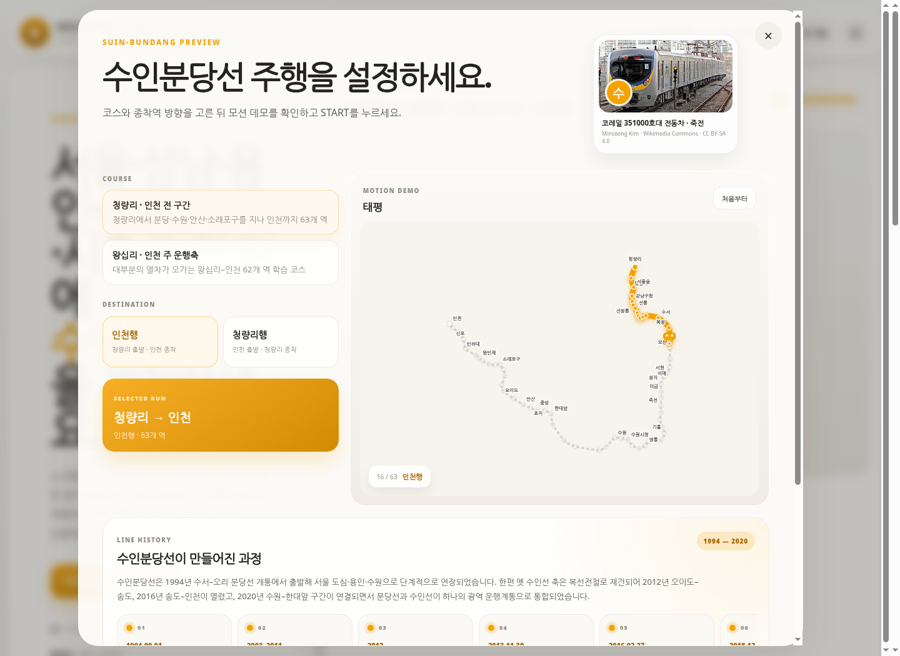

# RAILTYPE KOREA v27.0 · 수인분당선 기능 테스트

## 브라우저 통합 테스트

| 항목 | 결과 |
|---|---:|
| 수인분당선 플레이 가능 카드 | PASS |
| 청량리–인천 코스 | 63개 역 |
| 왕십리–인천 코스 | 62개 역 |
| 인천행·청량리행·왕십리행 전환 | PASS |
| START 전 노선 모션 노드 | 63개 |
| 전동차 이미지 연결 | PASS |
| 수인분당선 전용 최고 기록 필터 | PASS |
| 브라우저 런타임 예외 | 0개 |

## 입력 판정 테스트

인천 출발 청량리행 코스에서 확인했습니다.

1. 첫 입력 대상: `인천`
2. `인천역` 입력: 현재 역에 머무름
3. 피드백: `글자 추가 · “인천”의 철자를 다시 확인하세요.`
4. `인천` 정확 입력: 다음 역 `신포`로 이동

## 정적 검사

- JavaScript 전체 구문 검사: PASS
- HTML 로컬 파일 참조: 누락 0개
- 역사 코드·역명 중복: 0개
- 유효한 WGS84 좌표: 63 / 63

